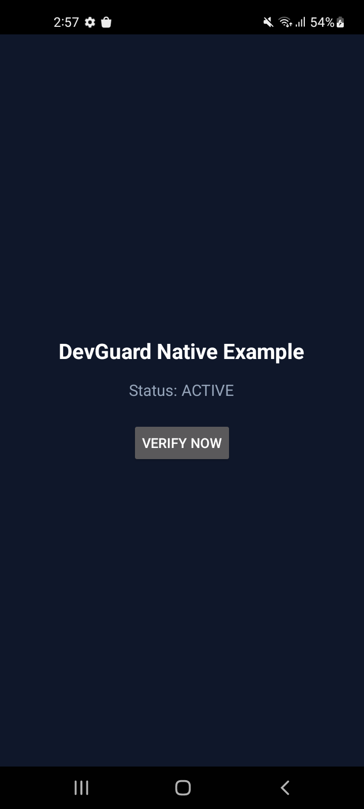
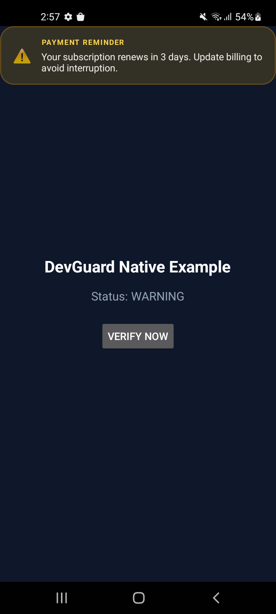
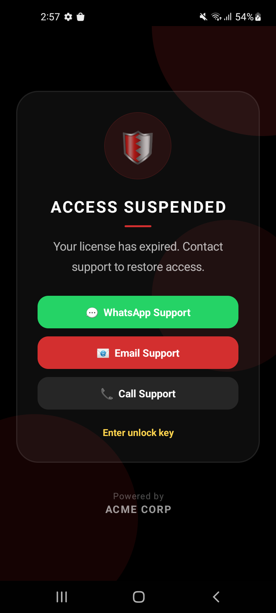

# Native Android DevGuard SDK

Kotlin SDK for native Android applications. Published artifact: **`io.devguard:android-sdk`**.

Public repository: [github.com/DevGuard-uk/android-dev-guard-sdk](https://github.com/DevGuard-uk/android-dev-guard-sdk)

<table>
  <tr>
    <td align="center" width="33%"></td>
    <td align="center" width="33%"></td>
    <td align="center" width="33%"></td>
  </tr>
</table>

## Features

- HMAC-signed verify against the DevGuard API
- GZip secure tunnel (`X-DevGuard-Tunnel: v1-gzip`)
- Premium lock screen (LOCKED / EXPIRED / PENDING / WARNING banner)
- Heartbeat + lifecycle sync (pauses in background)
- Device registration token persistence
- Remote wipe (`wipeNonce` / beta features)
- `setDeviceUser` for Developer Portal → Users
- Compromised-device and emulator policy enforcement
- Built-in plugin crash telemetry

## Install

Add JitPack and the SDK dependency in your app `build.gradle.kts`:

```kotlin
repositories {
    google()
    mavenCentral()
    maven { url = uri("https://jitpack.io") }
}

dependencies {
    implementation("com.github.DevGuard-uk.android-dev-guard-sdk:sdk:1.0.0")
}
```

Groovy `build.gradle`:

```groovy
repositories {
    google()
    mavenCentral()
    maven { url 'https://jitpack.io' }
}

dependencies {
    implementation 'com.github.DevGuard-uk.android-dev-guard-sdk:sdk:1.0.0'
}
```

[JitPack build page](https://jitpack.io/#DevGuard-uk/android-dev-guard-sdk)

## Quick start

```kotlin
DevGuard.init(
    context = applicationContext,
    projectId = "your_project_id",
    secret = "YOUR_MASTER_SECRET",
)
DevGuard.attachShield(activity)
```

Sign up at [devguard.uk](https://devguard.uk) for a **Project ID** and **Master Secret**.

## Build from source

```bash
./gradlew :sdk:assembleRelease
```

## Support

- **Issues:** [GitHub Issues](https://github.com/DevGuard-uk/android-dev-guard-sdk/issues)
- **Docs:** [devguard.uk/docs](https://devguard.uk/docs)
