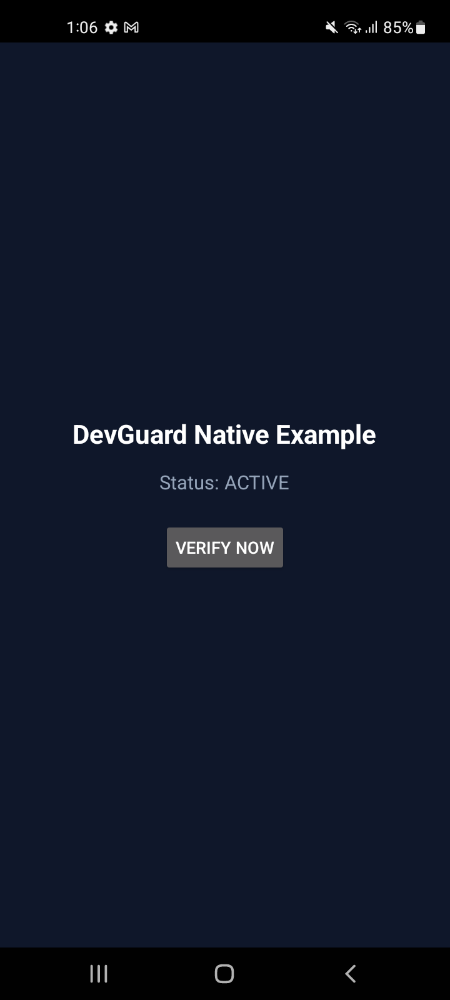
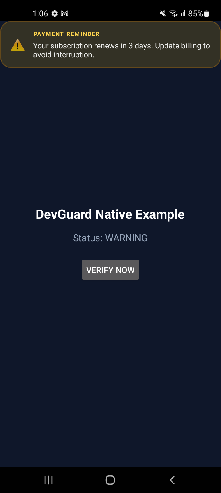
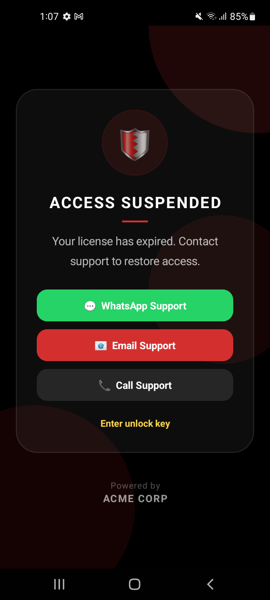

# Native Android DevGuard SDK

<p align="center">
  <a href="https://devguard.uk">
    
  </a>
</p>

<p align="center">
  <a href="https://devguard.uk"></a>
  <a href="https://github.com/DevGuard-uk/android-dev-guard-sdk"></a>
  
  
  
</p>

Kotlin SDK for native Android applications. Artifact: **`uk.devguard:android-sdk`**.

<table>
  <tr>
    <td align="center" width="33%"></td>
    <td align="center" width="33%"></td>
    <td align="center" width="33%"></td>
  </tr>
  <tr>
    <td align="center"><b>Active &amp; Protected</b><br/><code>ACTIVE</code></td>
    <td align="center"><b>In-App Warning</b><br/><code>WARNING</code></td>
    <td align="center"><b>Access Suspended</b><br/><code>LOCKED</code></td>
  </tr>
</table>

## Features

- HMAC-signed verify against the DevGuard API
- GZip secure tunnel (`X-DevGuard-Tunnel: v1-gzip`)
- Premium lock screen (LOCKED / EXPIRED / PENDING / WARNING banner)
- Heartbeat + lifecycle sync (pauses in background)
- Device registration token persistence
- Remote wipe (`wipeNonce` / beta features)
- `setDeviceUser` for Developer Portal → Users
- `setUserLog` for Developer Portal → User Journey (plan-gated upload)
- Compromised-device and emulator policy enforcement

## Install

Maven Central:

```kotlin
repositories {
    google()
    mavenCentral()
}

dependencies {
    implementation("uk.devguard:android-sdk:1.0.2")
}
```

Maven groupId, Sonatype namespace, and Kotlin imports all use **`uk.devguard.*`**.

Public repository: [github.com/DevGuard-uk/android-dev-guard-sdk](https://github.com/DevGuard-uk/android-dev-guard-sdk)

## Quick start

```kotlin
DevGuard.initialize(
    context = applicationContext,
    projectId = "your_project_id",
    secret = "YOUR_MASTER_SECRET",
)
```

Sign up at [devguard.uk](https://devguard.uk) for a **Project ID** and **Master Secret**.

## Support

- **Issues:** [GitHub Issues](https://github.com/DevGuard-uk/android-dev-guard-sdk/issues)
- **Docs:** [devguard.uk/docs](https://devguard.uk/docs)
